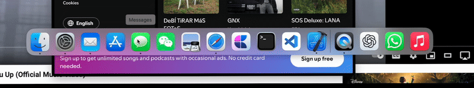
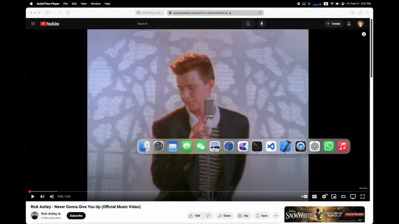
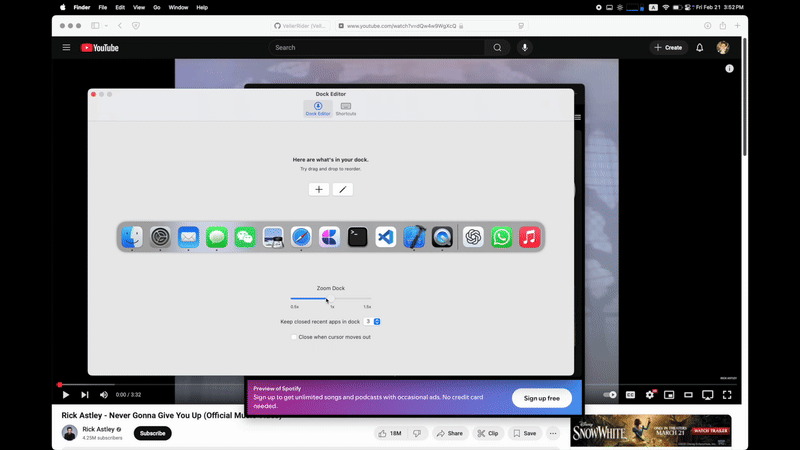

# AnoDock

A complementary macOS dock app.

This app is designed for mainly two types of user:

   1. **People using multiple monitors or a big wide monitor**. It's hard to reach macOS native dock under these setups. Unlike Windows, macOS only allows one dock across many screens, and moving it from one screen to another is slow and inefficient, especially when auto-hiding is turned on.
   2. **People with too many apps in their dock.** When using a MacBook on the go, the dock can become cluttered with apps, making icons too small to locate easily. This issue is particularly noticeable on small-screen devices and can cause eye strain.

**AnoDock** allow you to summon an additional dock interface at cursor's position. I designed it to resemble macOS’s native dock, so it should feel familiar and intuitive to use.

With this additional dock interface, you can quickly access your most frequently used apps without having to move the mouse across multiple screens to invoke the native dock.

And, If your native dock is overcrowded, you can move some apps to AnoDock. Your main dock will have more room to breath, it's gonna thank you for that.

You can customize which apps appear in the dock. Like macOS’s native dock, if an app is open but not pinned, it will show up in the **Recents** section. You can configure how many recently closed apps AnoDock should retain.

You can also rearrange or remove apps by dragging and dropping within the dock. Additionally, you can drag apps from Finder to add them to the dock. Note that you can only remove apps by dragging them out when either the settings tab or the dock interface is open.

I tried to make this app as close to macOS's native dock, but there are still many features not implemented. For example, you can pin files folders in native dock. It also manages all minimized  app windows.

I'm not sure if there is a need to add more features to it, because as a dock accessory instead of a replacement, simplicity is kinda important.

If you want to build more features on it, you are welcome to folk this repo.

